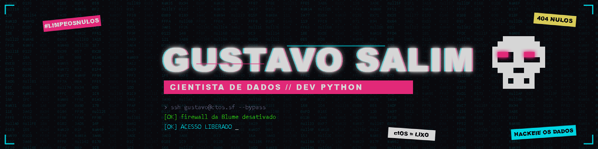

# Teste Vocacional com Machine Learning

Projeto em desenvolvimento. As etapas de coleta e limpeza dos dados estão concluídas; as próximas são a análise exploratória, a modelagem e o deploy.

A proposta é um teste vocacional baseado em dados, que usa Machine Learning para relacionar o perfil de interesses de uma pessoa às áreas de formação superior que mais combinam com ela.

## O problema

Escolher um curso superior é uma das decisões mais importantes na vida de um jovem, e muitas vezes ela é tomada com pouca informação: por pressão familiar, pela fama da profissão ou por influência dos amigos.

O projeto busca responder à seguinte pergunta: dado o perfil de interesses de uma pessoa, quais áreas de formação combinam mais com ela? A ideia é que o sistema recomende as três áreas mais compatíveis e mostre quais características do perfil pesaram em cada recomendação.

## Fundamentação: o modelo RIASEC

No início do projeto, cogitei partir de premissas como "pessoas antissociais tendem a fazer TI". Descartei essa abordagem por ser um estereótipo sem base científica e adotei o modelo RIASEC, criado pelo psicólogo John Holland e amplamente usado em orientação vocacional. Ele classifica os interesses em seis dimensões:

| Sigla | Dimensão | Interesses típicos |
|---|---|---|
| R | Realista | atividades práticas, ferramentas, máquinas, natureza |
| I | Investigativo | pesquisar, analisar, resolver problemas |
| A | Artístico | criar, se expressar, inovar |
| S | Social | ajudar, ensinar, cuidar de pessoas |
| E | Empreendedor | liderar, persuadir, negociar |
| C | Convencional | organização, dados, rotinas e processos |

## Dados

| Fonte | Uso no projeto |
|---|---|
| [Open Psychometrics - RIASEC, 48 itens](https://openpsychometrics.org/_rawdata/) | Base de treino: 145.828 respostas ao teste RIASEC (2015 a 2018), com o curso de cada participante |
| Classificação CINE Brasil (INEP) | Áreas gerais de formação usadas para agrupar os cursos |
| INEP - Censo da Educação Superior (planejado) | Contexto brasileiro: cursos mais procurados e concluintes |
| MEC - Catálogo de Cursos (planejado) | Descrição do que cada curso estuda |

O dicionário de dados original está em inglês. Fiz uma tradução para português em [docs/codebook_ptbr.md](docs/codebook_ptbr.md), pensando em quem está começando e ainda não domina o idioma.

## Etapas do projeto

| Etapa | Notebook | Situação |
|---|---|---|
| 1. Coleta e exploração inicial | [01_coleta.ipynb](notebook/01_coleta.ipynb) | concluída |
| 2. Limpeza e engenharia de atributos | [02_limpeza.ipynb](notebook/02_limpeza.ipynb) | concluída |
| 3. Análise exploratória | 03_eda.ipynb | próxima |
| 4. Modelagem | 04_modelagem.ipynb | pendente |
| 5. Avaliação | 05_avaliacao.ipynb | pendente |
| 6. Deploy (aplicação web com Flask) | - | pendente |

## Limpeza dos dados

Todas as decisões abaixo estão explicadas no notebook `02_limpeza.ipynb`.

| Problema encontrado | Decisão |
|---|---|
| Coluna vazia `Unnamed: 93`, criada por uma tabulação extra no fim de cada linha | Antes de remover, investiguei o conteúdo: havia um único valor, o curso *economics*, deslocado porque o participante digitou uma tabulação. O valor foi recuperado e a coluna removida |
| Respostas 0 nas perguntas RIASEC, cuja escala vai de 1 a 5 (o 0 indica pergunta não respondida) | Participantes com 5 ou mais perguntas em branco (mais de 10% do teste) foram removidos. Nos demais, o 0 foi convertido em valor ausente, para não ser tratado como nota baixa |
| Participantes que disseram conhecer palavras inventadas (*cuivocal*, *florted*, *verdid*), incluídas no questionário como verificação de atenção | Removidos os que marcaram duas ou mais |
| Idades impossíveis, como 666, 1997 e 2.147.483.647 | Apenas o valor foi anulado. O participante foi mantido, já que a idade não entra no modelo |
| Curso digitado em texto livre, com cerca de 15 mil variações e muitos erros de digitação | Texto padronizado e agrupado nas 10 áreas gerais da CINE Brasil, por meio de regras de palavras-chave (expressões regulares) |
| Perguntas em branco no cálculo do perfil | O escore de cada dimensão é a média das perguntas que a pessoa respondeu, sem preencher lacunas com a média da população |

Quantidade de participantes em cada etapa:

| Etapa | Removidos | Restantes |
|---|---|---|
| Dataset original | - | 145.828 |
| 5 ou mais perguntas em branco | 361 | 145.467 |
| 2 ou mais palavras inventadas | 7.283 | 138.184 |
| Sem curso informado | 50.122 | 88.062 |
| Curso inválido ou não classificado | 6.370 | 81.692 |

Ao final, restaram 81.692 participantes, cada um com os seis escores RIASEC (variáveis de entrada) e a área de formação (variável alvo).

## Observações até aqui

As perguntas mais deixadas em branco (operar uma máquina retificadora, reger um coral, vender franquias de restaurantes) têm em comum descrever atividades pouco familiares para a maioria das pessoas. Pretendo reescrevê-las com mais clareza na versão brasileira do teste.

Levantei a hipótese de que mulheres deixariam mais em branco as perguntas sobre trabalho manual, mas os dados não a confirmaram: os homens deixam mais perguntas em branco, em todas as dimensões. Por outro lado, as mulheres marcam "não gosto" com mais frequência nas perguntas da dimensão Realista (54% contra 31% dos homens). É uma diferença de interesses já documentada na literatura e que exige cuidado na modelagem, como descrito abaixo.

## Considerações éticas e limitações

- O sistema sugere, não determina. O resultado deve servir como ponto de partida para reflexão, e não como uma avaliação da capacidade de alguém.
- Nenhum dado pessoal identificável é coletado, em respeito à LGPD.
- Para reduzir o risco de viés de gênero, a variável `genero` não será usada como entrada do modelo, e o desempenho será avaliado separadamente por gênero.
- A base de treino tem respondentes majoritariamente de países de língua inglesa, e 65% dos participantes são mulheres.
- As áreas Serviços (192 participantes) e Agricultura e veterinária (141) têm poucos exemplos, o que será levado em conta na modelagem.
- Cerca de 5% dos cursos não foram reconhecidos pelas regras de classificação e ficaram de fora.

## Estrutura do projeto

```
Teste_Vocacional_ML/
├── dados/
│   ├── Dados originais/      # dados brutos, nunca alterados
│   └── Dados processados/    # dados tratados, gerados pelos notebooks
├── docs/
│   └── codebook_ptbr.md      # dicionário de dados traduzido
├── notebook/
│   ├── 01_coleta.ipynb
│   └── 02_limpeza.ipynb
├── src/                      # funções reutilizáveis (em construção)
└── README.md
```

## Como executar

Crie e ative um ambiente virtual e instale as dependências (exemplo no Windows, com PowerShell):

```bash
python -m venv .venv
.venv\Scripts\Activate.ps1
pip install pandas numpy matplotlib seaborn ipykernel watermark
```

Em seguida, baixe o dataset RIASEC em [openpsychometrics.org/_rawdata](https://openpsychometrics.org/_rawdata/), extraia os arquivos `data.csv` e `codebook.txt` em `dados/Dados originais/` e execute os notebooks em ordem (`01_coleta` e depois `02_limpeza`), usando o kernel do ambiente virtual.

Ambiente utilizado: Python 3.14, pandas 3.0 e NumPy 2.5.

## Tecnologias

Python, pandas, NumPy, Matplotlib, Seaborn, Jupyter e expressões regulares. Nas próximas etapas, pretendo usar scikit-learn, XGBoost, SHAP e Flask.

## Créditos

- Dados: [Open Psychometrics Project](https://openpsychometrics.org/).
- A estrutura dos notebooks segue a didática do curso de Ciência de Dados do Prof. Dilermando Piva.
- Modelo teórico: Holland, J. L. *Making Vocational Choices: A Theory of Vocational Personalities and Work Environments*.

## Autor

Gustavo. Projeto de portfólio em Ciência de Dados.
